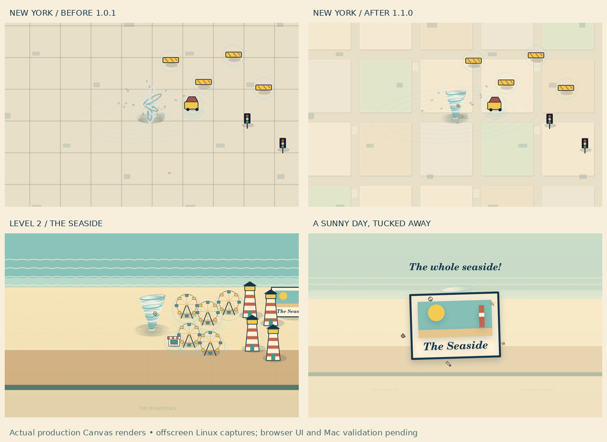

# GroundedDI-Desktop-Builds
Development repository for Grounded DI native desktop applications. Documents local-first software architecture, source code, build workflows, packaging, testing, and platform-specific implementation for macOS and Windows.

## BriefWise DI² on Gemini — report and control

**13 September 2026 · Grounded DI LLC**

A cross-engine legal drafting example, a revealing Gemini control, and a source-linked audit of both answers. Includes Gemini’s subsequent acknowledgments, the comparison’s limits, and redacted supporting evidence.

[Read the report and overview](reports/briefwise-di2-on-gemini/README.md) · [Open the redacted PDF](reports/briefwise-di2-on-gemini/BriefWise_DI2_on_Gemini.pdf)

## The Tornado — one-prompt upgrade from 5.6 SOL to Astra

**7 September 2026 · Grounded DI LLC**

The Tornado is a small family game built through Grounded DI / FastPath. As reported by creator Mark S. Weinstein, the existing **v1.0.1 build developed with 5.6 SOL** was upgraded to **v1.1.0 with Astra through one upgrade prompt**. This describes the upgrade of an existing game, including its inherited code and assets.

The result keeps the original New York adventure and adds a second place to play: **The Seaside**, with a boardwalk, Ferris wheels, lighthouses, and a postcard finale.

### What changed

- A continuous ribbon-shaped tornado with a clear yellow eye, refined airborne-object sizing, and smoother camera zoom.
- Softer paper-style New York city blocks, preserving the original 99-object level.
- A new 60-object Seaside level with eight object kinds and separate progression and records.
- Movement speed increased by **20%** in each movement band. This is a gameplay setting, not a model-performance comparison.
- Both levels are available immediately, with no automatic next level, lives, countdown, ads, or purchases.

### Seaside gameplay video — sound removed

[Watch or download the muted Level 2 video](media/the-tornado-level-2-muted.mp4).

The creator-supplied clip shows the Seaside sequence and postcard finale. The published copy has **no audio track**; the video stream is retained without re-encoding.

### Build evidence and scope

The supplied v1.1.0 build record reports **45 passing tests in nine files**, TypeScript checks, ESLint, and a production build, plus scripted replay and offscreen-render checks. Those are builder-recorded results; the publication step did not rerun the application test suite.

The comparison image contains actual production Canvas renders captured offscreen on Linux. Its footer preserves the build-time qualification: browser UI and Mac validation pending. The additional gameplay clip provides a visual demonstration; it does not close the full browser/native acceptance checklist. The supplied build remains labeled **DRAFT** pending those checks.

This post shares the visible upgrade and a short gameplay demonstration. Private prompts, runtime packages, source archives, and internal governance materials are not included.
