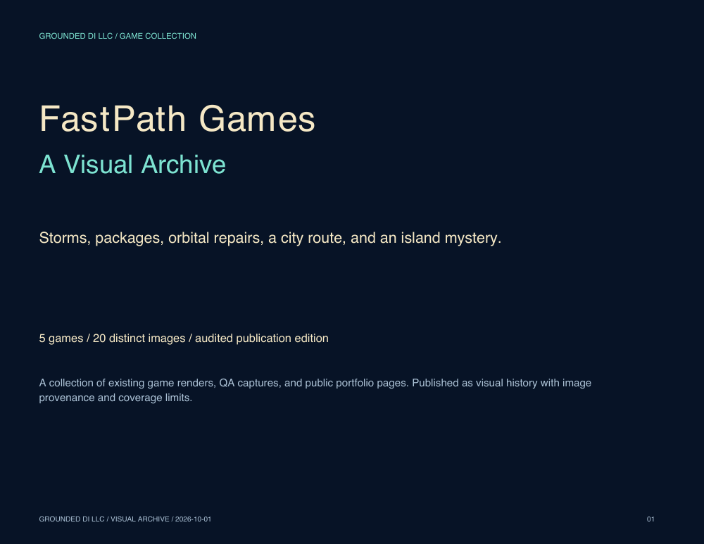

# FastPath Games - A Visual Archive

A visual history of five Grounded DI games: **The Tornado**, **The Courier: Wrong Door**, **PUT THE MOON BACK**, **The Morning Line**, and **Page Two**.

**[Read the 23-page book](fastpath-games-visual-archive.pdf)** · [Browse the illustrated source](fastpath-games-visual-archive.md) · [Screenshot assets](screenshots/) · [Publication audit](AUDIT.md)



## Inside the book

| Game | Images | Book pages | Coverage |
| --- | ---: | --- | --- |
| The Tornado | 5 | 3-7 | New York, The Seaside, Fire & Ice, Rainbow Road, and Rainbow finale |
| The Courier: Wrong Door | 5 | 8-12 | Opening route, package traffic, overdrive, rescue scenario, and shift clear |
| PUT THE MOON BACK | 5 | 13-17 | Title, orbital gameplay, mission selection, seeded challenges, and Your Moon |
| Grounded DI City - The Morning Line | 1 | 18 | Audit Blue route, junction progress, and cargo ledger |
| Page Two | 4 | 19-22 | Title, comfort settings, credits, and Mailboat Cabin |

The publication contains **20 distinct images**, each used once in the PDF. Captions and source notes accompany every image. The archive preserves the original image framing and aspect ratios.

## Sources and coverage

This edition uses existing local game QA renders and published portfolio captures. It does **not** present them as newly saved screenshots from live play. Earlier live inspection informed game identification, but the published images have the following sources:

- **Tornado:** local candidate visual-QA files named `new-york-start.png`, `seaside-start.png`, `fire-ice-start.png`, `rainbow-road-start.png`, and `rainbow-road-finale.png`. These are field/finale renders without the native HUD. The inspected 1.3.0 menu lists Rainbow Road as level 4; the finale provides the fifth image.
- **Courier:** local closeout visual-QA files named `play-first-ten-seconds.png`, `play-two-package-overlap.png`, `play-stage-3-overdrive.png`, `play-successful-rescue.png`, and `play-shift-complete.png`. Scenario names come from the source files and do not independently prove a newly executed run.
- **Moon:** [existing public portfolio](../../PUT_THE_MOON_BACK_Games_on_Mac_Visual_Portfolio_Grounded_DI_LLC.pdf), pages 2, 3, 4, 6, and 9. Portfolio labels and framing are retained.
- **Morning Line:** [existing public gameplay PDF](../../Grounded_DI_City%20_The_Morning_Line_on_Mac_Six_Prompts_for_Level_1_of_Game.pdf), page 1.
- **Page Two:** [existing public screenshot PDF](../../Page_Two_v1.0_Mac_Game_from_One_Prompt_Grounded_DI_LLC_Screenshots.pdf), all four pages. This game was added during the publication audit; no live build was opened in that audit.

**Coverage remains partial:** The Morning Line has one image, below the original 3-5-image target. Galaxy Chess Explorer: Strategy Quest was named in a local safety document, but a runnable build was not located; it is excluded from the illustrated count. This is a bounded collection of identified games, not an exhaustive inventory or completion record.

## Rebuild the book

The generator is self-contained and resolves assets relative to its own directory. It requires Python 3.10+ and the packages in `requirements.txt`; it does not launch games or contact the network while generating the book.

```bash
cd media/fastpath-games
python3 -m venv .venv
.venv/bin/python -m pip install -r requirements.txt
.venv/bin/python build_archive.py
```

This regenerates the PDF and illustrated Markdown from the captions in `build_archive.py` and the unchanged `screenshots/` assets. The generator uses fixed PDF metadata for repeatable output with the same dependencies.

Verify the published package on macOS:

```bash
shasum -a 256 -c SHA256SUMS.txt
```

On Linux, use `sha256sum -c SHA256SUMS.txt`. Checksums establish file identity; they are not gameplay test results. After intentional edits, visually review a fresh render and regenerate the manifest before publication.

## Publication details

- Edition: October 1, 2026, audited publication revision.
- Publisher: Grounded DI LLC.
- Scope: visual documentation, editable book generator, and image assets. Game source code and executable distributions are maintained separately.
- Rights: the repository's existing intellectual-property terms apply. No additional license is granted by this package.

Suggested citation: Grounded DI LLC. (2026). *FastPath Games - A Visual Archive*. Grounded DI Desktop Builds, audited publication edition.
