# FastPath Games - A Visual Archive

Grounded DI LLC | Audited publication edition | 2026-10-01

Five games, twenty distinct images. Existing QA renders and portfolio captures; these are not newly saved screenshots from live play.

## The Tornado

Collect-and-grow play across city streets, a beach, ice, and a rainbow road.

**Source and coverage:** Existing local visual QA renders; these frames omit the native HUD. Rainbow Road is level 4 in the inspected 1.3.0 menu, not a separate fifth level.

### 01 / New York

The city field contains blocks, cones, small objects, and the tornado.

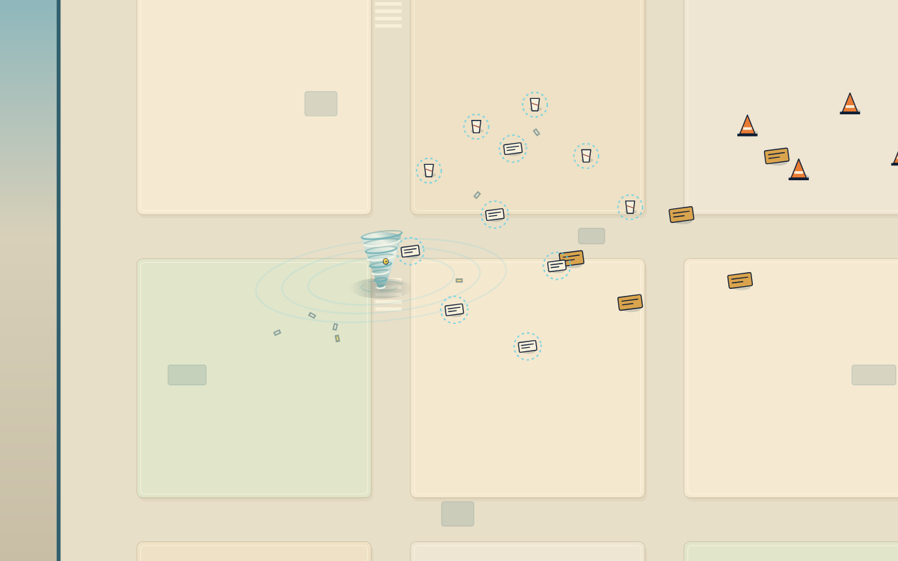

### 02 / The Seaside

A sandy field introduces beach objects and a warm palette.

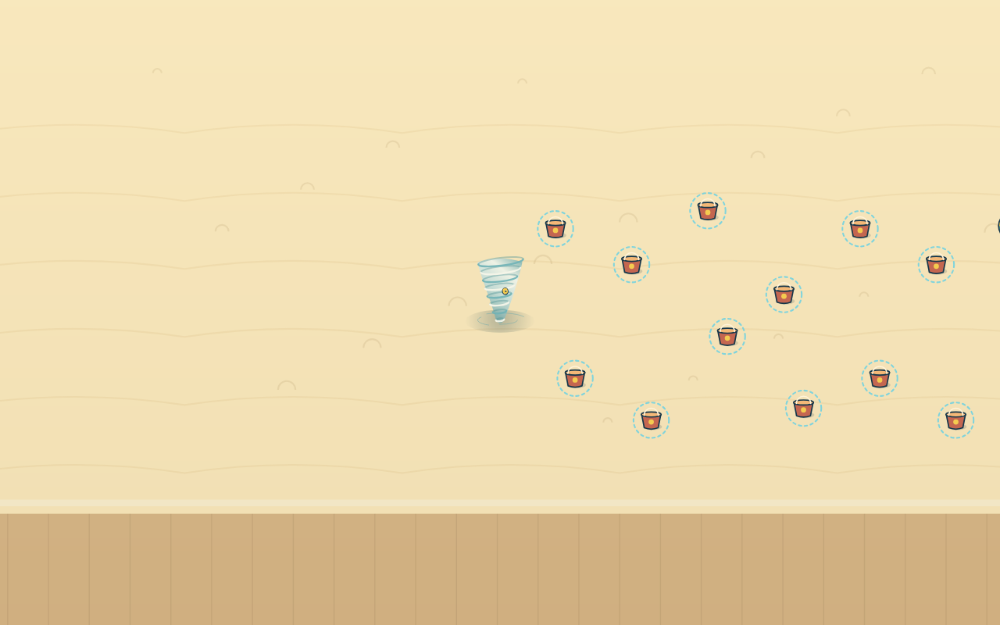

### 03 / Fire & Ice

The opening icy field shows flags and scattered collectible objects.

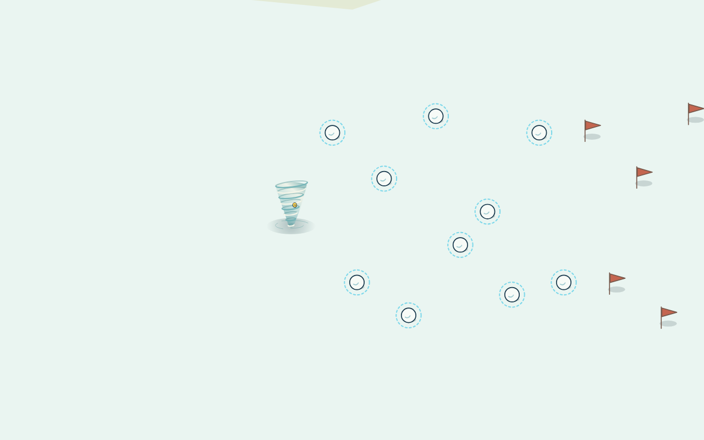

### 04 / Rainbow Road

Colored lanes and star shapes give the fourth adventure its visual identity.

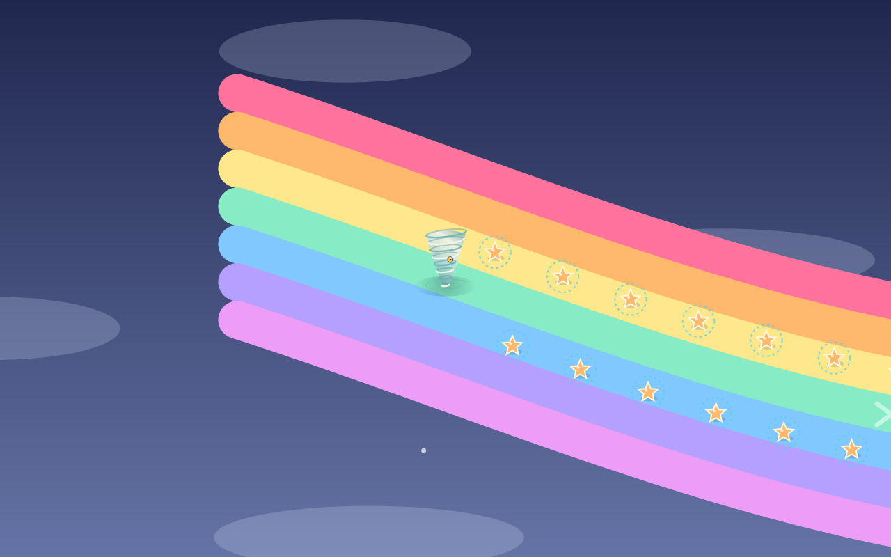

### Rainbow Road / Finale

The existing finale render reads: A whole rainbow, tucked away. This is not evidence of a newly completed run.

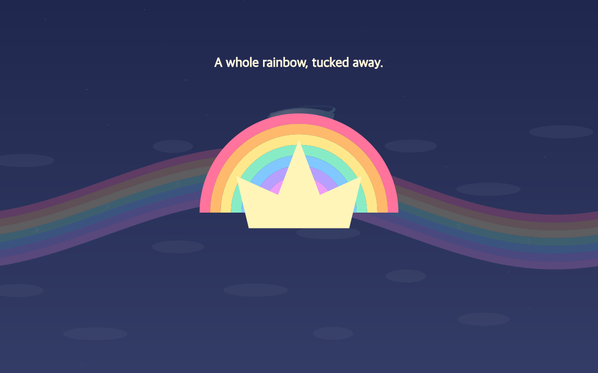

## The Courier: Wrong Door

Route packages through a small network to their matching destinations.

**Source and coverage:** Existing local visual QA captures. File names identify scenarios; the images do not establish a newly completed session.

### Opening route

The network, package, destinations, and score are visible.

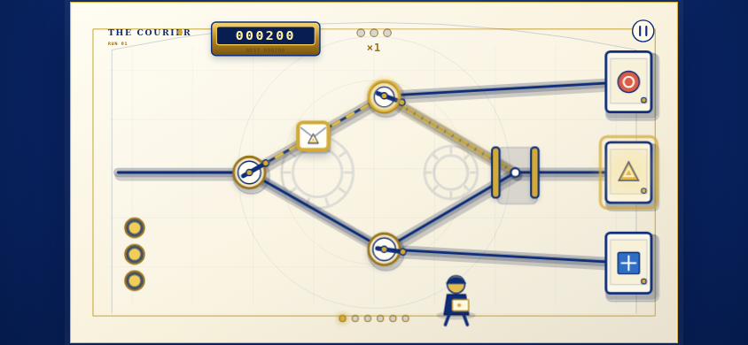

### Package traffic

The QA scenario is named two-package-overlap; this frame records its network state.

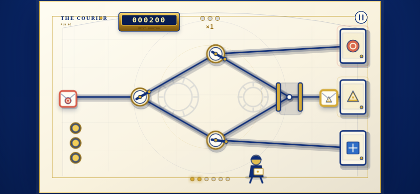

### Stage 3 / Overdrive

An escalation capture from the local QA collection, with route and score feedback.

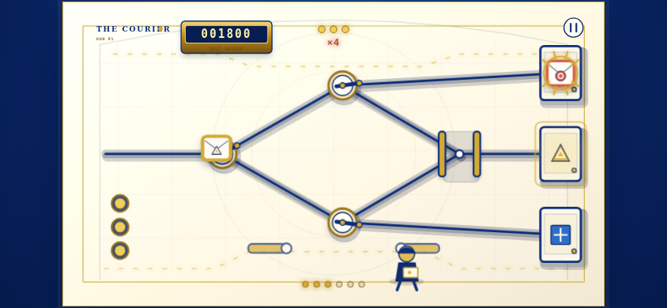

### Rescue scenario

The QA capture is named successful-rescue. Its score and destination feedback are preserved.

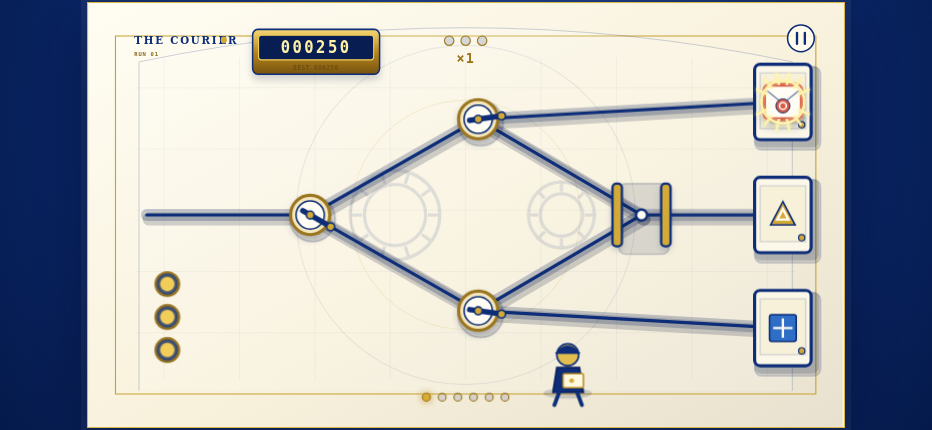

### Shift clear

The existing completion capture shows SHIFT CLEAR, a score, and AGAIN.

## PUT THE MOON BACK

An orbital puzzle about moving the Moon while watching the consequences of each intervention.

**Source and coverage:** Existing public visual portfolio, pages 2, 3, 4, 6, and 9. Portfolio framing is retained. A local mission was separately opened during the earlier review.

### It Was Fine Where It Was

The title screen introduces the Moon and the game navigation.

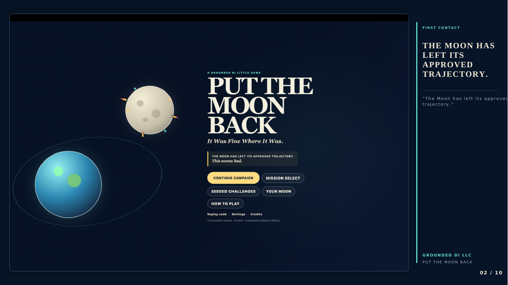

### Orbital gameplay

Earth, the Moon, orbit guides, and control panels share the playfield. No mission number is inferred from this image.

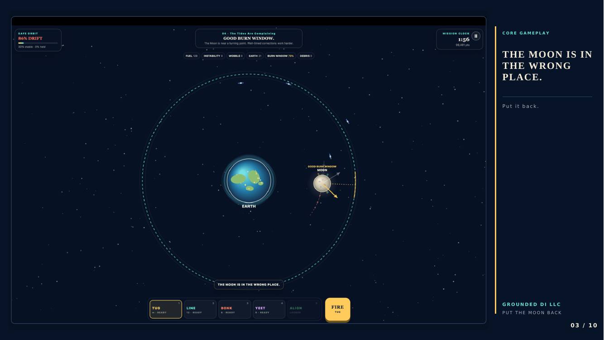

### Mission selection

The campaign selection screen presents a collection of lunar problems.

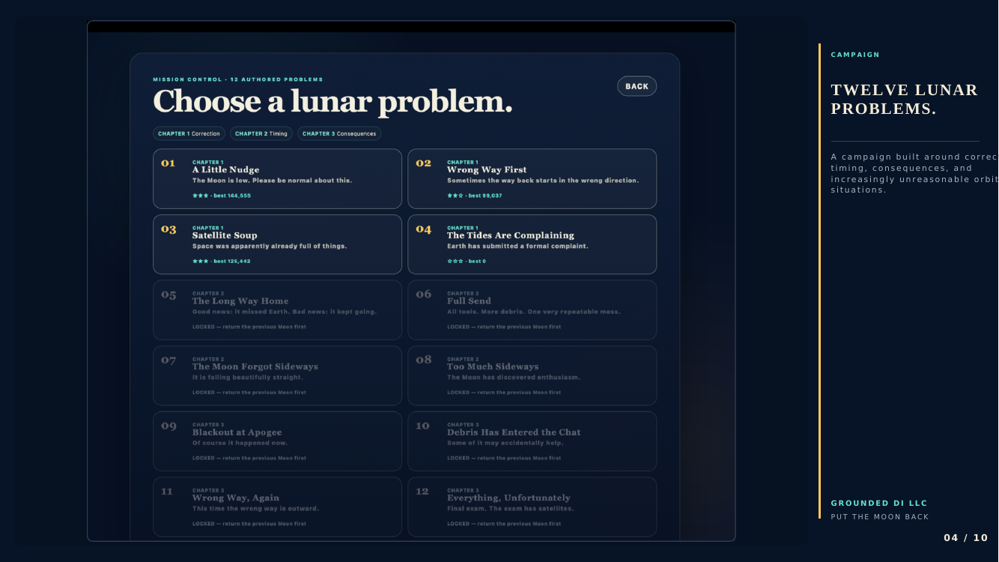

### Seeded challenges

The portfolio records the challenge selection interface.

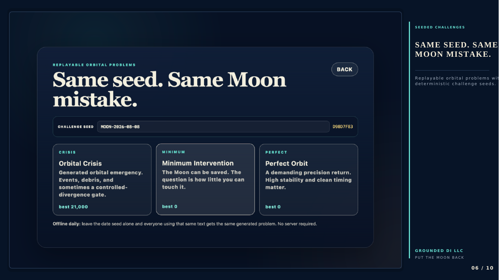

### Your Moon

The portfolio presents a persistent Moon profile: It remembers what you did to it. This is not a replay-verification result.

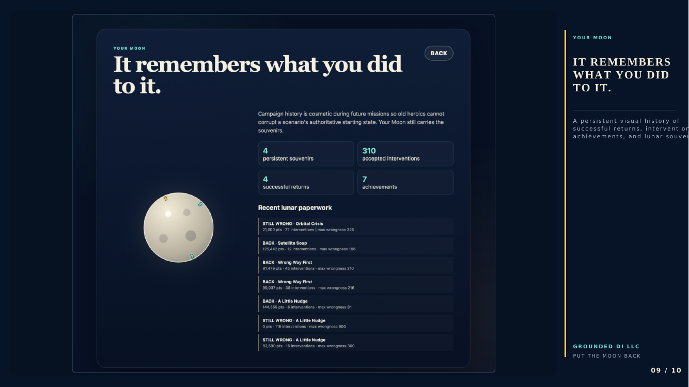

## Grounded DI City - The Morning Line

A city-and-tram puzzle with route controls, junction progress, and a cargo ledger.

**Source and coverage:** One existing public gameplay capture is available in this edition. The requested 3-5 images are not yet met for this game; no completed live run is claimed.

### Audit Blue / City route

The city view shows the tram, route choices, cargo ledger, and junction progress together.

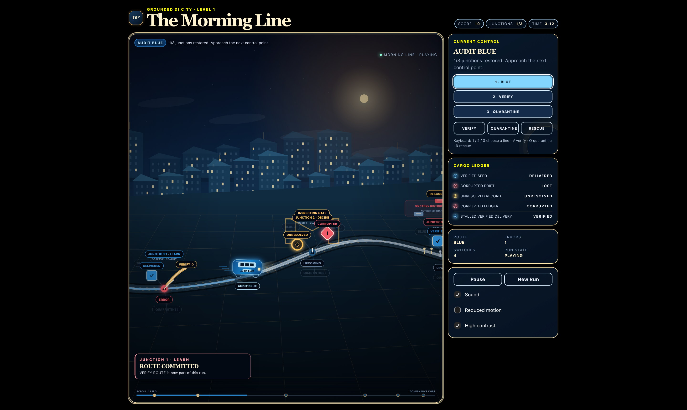

## Page Two

A storybook mystery set on Bellweather Island in summer 1985: find the glasses and follow the clues.

**Source and coverage:** Four pages from the existing public v1.0 screenshot PDF. Added during publication audit; no runnable build was opened for this game.

### A Little Mystery Comes Into Focus

The title screen offers New Story, Settings, and Credits.

### Comfort & Sound

Settings expose sound, reduced motion, reduced blur, high contrast, and text speed.

### Credits / Version 1.0.0

The credits identify Grounded DI and describe the original family adventure.

### Chapter One / Mailboat Cabin

Out of Focus introduces Listen, Touch, a notebook, and a gentle nudge.

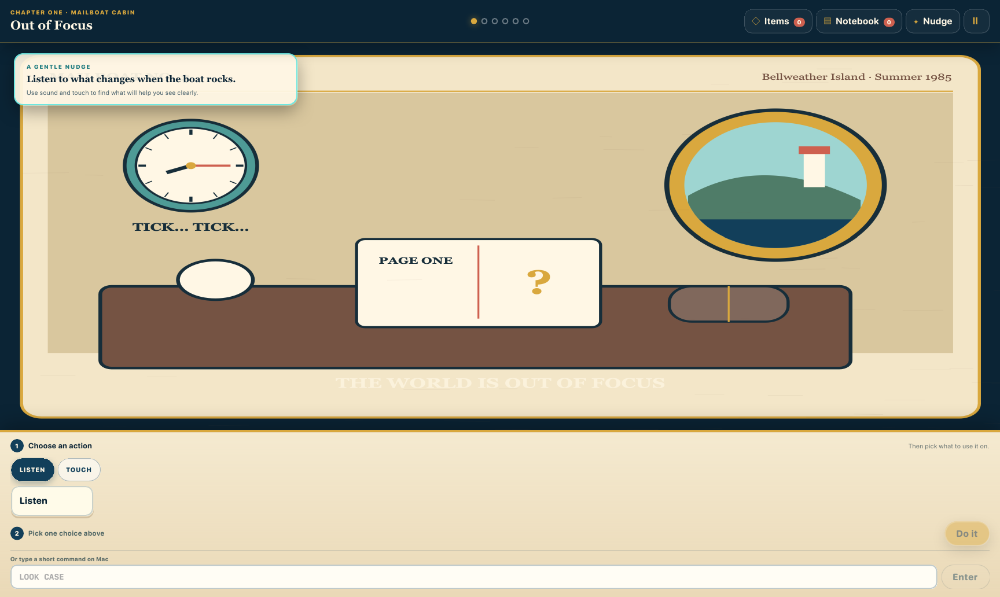

## Coverage limits

The Morning Line has one image. Galaxy Chess Explorer: Strategy Quest was named in a local safety document, but no runnable build was located. This is a bounded archive, not an exhaustive inventory or a claim of completed live play.
